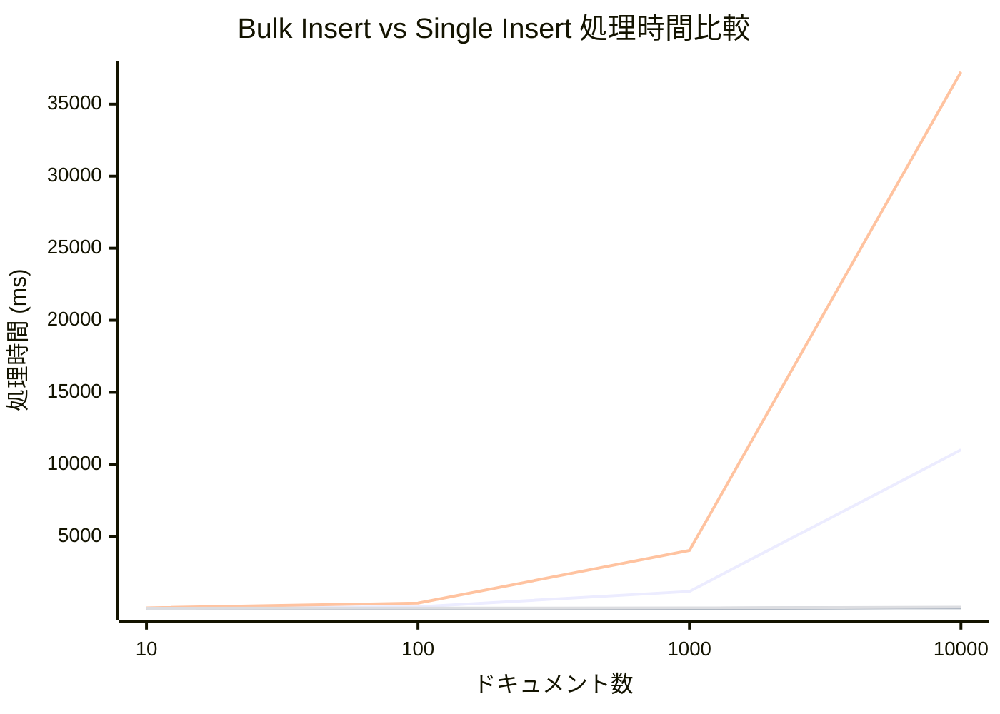

# Bulk Insert vs Single Insertによるパフォーマンス比較

Elasticsearchへのデータ登録において、ドキュメントを1件ずつ登録する`Single Insert`方式と、まとめて一括で登録する`Bulk Insert`方式のパフォーマンスを比較するためのプロジェクトです。

本検証では、純粋なデータ投入速度（スループット）と、データ投入後に即時検索可能になるまでの時間（レイテンシ）の2つの観点から、両者の性能を測定します。

# ベンチマークテストの実行

### 1. Elasticsearchの起動

テストを実行するには、ローカル環境でElasticsearchが起動している必要があります。
プロジェクトのルートディレクトリにある `docker-compose.yml` を使用して、Dockerコンテナを起動します。

```bash
# プロジェクトのルートディレクトリへ移動
cd ../

# Dockerコンテナをバックグラウンドで起動
docker-compose up -d

# bulk-insert-vs-single-insert ディレクトリへ戻る
cd bulk-insert-vs-single-insert
```

### 2. ベンチマークの実行

以下のコマンドでベンチマークテストを実行します。

```bash
go test -bench=. -benchmem
```

# 結果

### 測定結果

ベンチマークの測定結果は以下の通りです。`refresh`オプションの有無で「スループット重視」と「即時反映重視」の2つの観点から比較します。処理時間はミリ秒（ms）単位です。

| ドキュメント数 | Single (スループット) | Bulk (スループット) | Single (即時反映) | Bulk (即時反映) |
| :--- | ---:| ---:| ---:| ---:|
| 10 | 12.1 | 5.9 | 41.1 | 17.3 |
| 100 | 113.8 | 8.6 | 372.6 | 22.3 |
| 1000 | 1,181.5 | 13.3 | 4,026.2 | 35.9 |
| 10000 | 11,009.0 | 55.1 | 37,227.8 | 86.0 |

### グラフ

**注：** `SingleInsert`と`BulkInsert`の性能差が非常に大きいため、以下のグラフでは`BulkInsert`の線がほぼ横軸に重なって見えます。正確な性能差は上の表をご参照ください。



### 結論

- **スループット重視の場合**: `BulkInsert`が`SingleInsert`を圧倒します（10000件で約200倍）。
- **即時反映を重視する場合**: `BulkInsertWithRefresh`が唯一の現実的な選択肢です（10000件で`SingleInsertWithRefresh`の約433倍高速）。
- **即時反映のコスト**: `BulkInsert`に`refresh: "true"`を追加するコストは比較的小さいですが、`SingleInsert`で同じことを行うと処理時間が壊滅的に増大します。

Elasticsearchへデータを登録する際は、ユースケースに応じて`refresh`オプションを適切に設定した上で、常に**Bulk API**を利用することがベストプラクティスであると結論付けられます。
