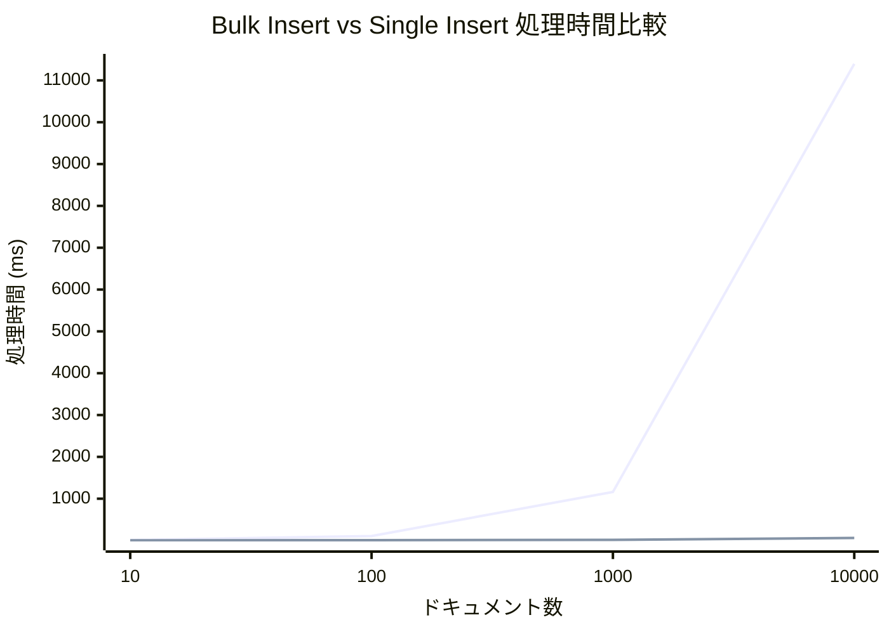

# Bulk Insert vs Single Insertによるパフォーマンス比較

Elasticsearchへのデータ登録において、ドキュメントを1件ずつ登録する`Single Insert`方式と、まとめて一括で登録する`Bulk Insert`方式のパフォーマンスを比較するためのプロジェクトです。

Go言語のベンチマーク機能を用いて、ドキュメント件数を `10, 100, 1000, 10000` と変化させた場合のそれぞれの処理速度を計測します。

# ベンチマークテストの実行

### 1. Elasticsearchの起動

テストを実行するには、ローカル環境でElasticsearchが起動している必要があります。
プロジェクトのルートディレクトリにある `docker-compose.yml` を使用して、Dockerコンテナを起動します。

```bash
# プロジェクトのルートディレクトリへ移動
cd ../

# Dockerコンテナをバックグラウンドで起動
docker-compose up -d

# bulk-insert-vs-single-insert ディレクトリへ戻る
cd bulk-insert-vs-single-insert
```

### 2. ベンチマークの実行

以下のコマンドでベンチマークテストを実行します。

```bash
go test -bench=. -benchmem
```

# 結果

### 測定結果

ベンチマークの測定結果は以下の通りです。処理時間はミリ秒（ms）単位で表記しています。

| ドキュメント数 | SingleInsert (ms) | BulkInsert (ms) | 性能差 |
| :--- | ---:| ---:| :--- |
| 10 | 12.0 | 6.3 | **1.9倍** |
| 100 | 106.6 | 9.4 | **11.3倍** |
| 1000 | 1,161.9 | 16.6 | **70.0倍** |
| 10000 | 11,393.4 | 60.0 | **189.9倍** |

### グラフ

**注：** `SingleInsert`と`BulkInsert`の性能差が非常に大きいため、以下のグラフでは`BulkInsert`の線がほぼ横軸に重なって見えます。正確な性能差は上の表をご参照ください。


